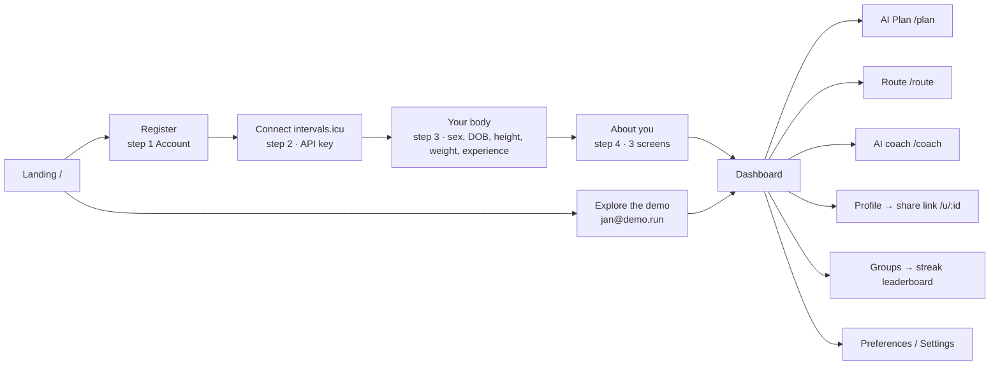

# User journey

Back to [[00 Home]] · Screens live in [[Frontend]]; calls are in [[API reference]].

## 1. Account (step 1)
Name, email, password. The account exists from here on — a half‑registered user who leaves and comes back is
sent to the **next unfinished step** (`homeFor(user)` guard; landing says "Finish setup", not "Dashboard").

## 2. Connect intervals.icu (step 2, required)
- One field: the intervals.icu **API key** (masked text so browsers don't offer to save it).
- Backend checks the key with `GET /athlete/0` on intervals.icu, stores it **encrypted** (Fernet), imports
  90 days of activities + wellness, and returns a summary ("77 activities · 24 runs · 90 days of wellness").
- intervals.icu relays Garmin, Strava, Polar, Apple — so one connector covers most watches.

## 3. Your body (step 3)
Sex, date of birth, height, weight, experience (`new | lt1 | 1to3 | 3plus`). Pre‑filled from intervals.icu where
available ("From intervals.icu" tag). If intervals.icu is down, the form still renders so onboarding can finish.

## 4. About you — 3 screens (step 4)
Every default is preset so **Continue works on first view**:
1. **Goal** — 5 km / 10 km / Half / Marathon / Just fitness (suggested from your longest run), optional race date,
   plan start = next Monday.
2. **Your week** — 7 day squares (2–6 days), ★ long‑run day, time limits weekday/weekend; a "how long can you run
   non‑stop?" question only if you ran fewer than 3 times in 28 days.
3. **Health** — "I feel fine" or: some pain / pain stops me / injury in last 6 months / PAR‑Q (heart, chest pain,
   dizziness). PAR‑Q or "pain stops me" → calm note: no plan until a doctor clears you.

These answers are exactly the input the [[ML planner]] needs (`TrainingAnswers` ↔ `make_plan(ans)`).

## 5. Daily use
- **Dashboard** syncs new runs from intervals.icu on open, shows the **streak card**, weekly km, pace trend,
  records, wellness.
- **AI Plan** — gate: ≥ 5 runs in the last 30 days. Generate → month calendar, drag to swap days, edit a session,
  delete → rest day, set a start time, regenerate (only if something changed). Blocked plans explain why.
- **Route** — pick a start (city, GPS, search, or click), distance and time → loop on the map + weather + elevation.
  Right‑click sets a finish point.
- **AI coach** — chat or call iRunny: "too hard", "my knee hurts", "how was my last run?", "I can't run Sunday".
- **Groups** — account menu → Groups: create a group or join one by typing its exact name; the group page is a
  leaderboard of members' streaks (medals for the top 3, "Last day" / "Ended" chips, your row highlighted).
- **Profile** — "Make profile public" in the account menu → copy share link → anyone sees `/u/:id`.
