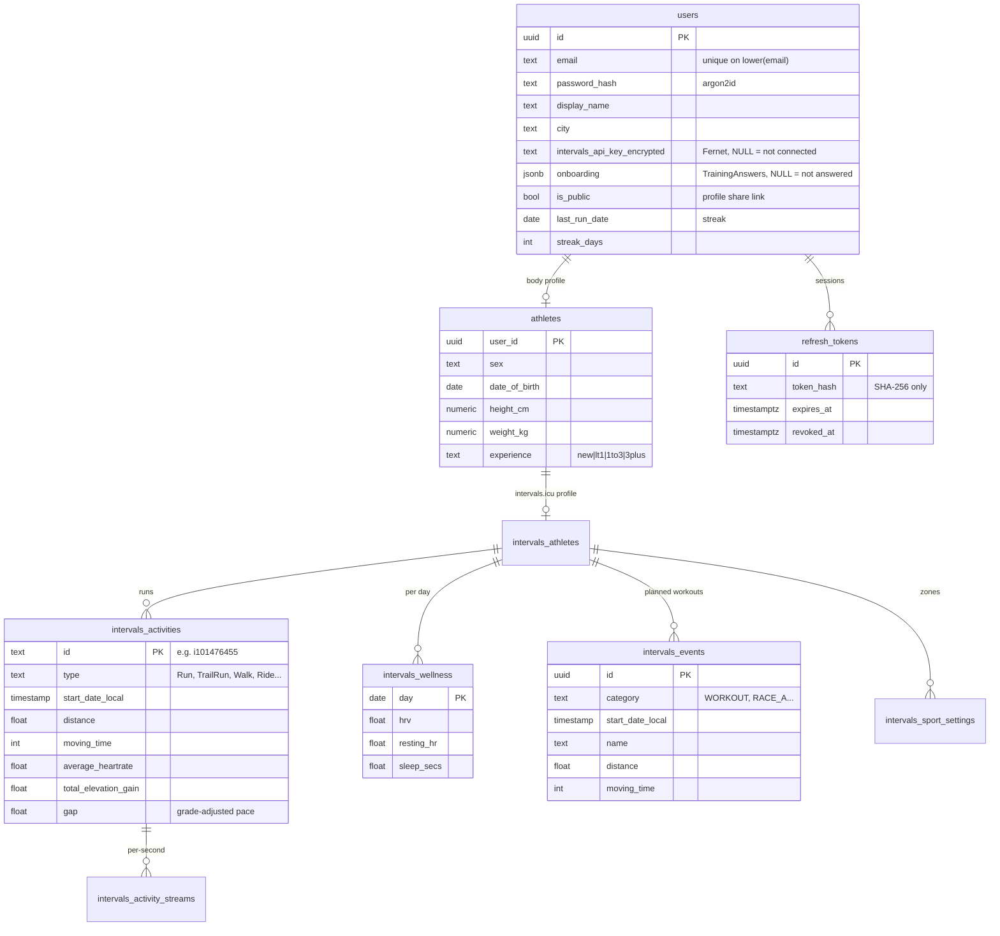

# Data model

Back to [[00 Home]] · Owner: [[Backend]]

Postgres 16. The schema is **plain SQL** in `scripts/sql/` (no Alembic): `init.sql` (app tables),
`intervals_schema.sql` (mirror of intervals.icu data), `seed.sql` (10 demo users). Postgres runs them **only on
an empty `data/postgres`** — after a schema change, wipe it or `ALTER TABLE` by hand (debug-05, debug-06).
SQLAlchemy 2.0 ORM models in `backend/app/infrastructure/db/models/` must stay in sync; an integration test
(`test_orm_models_match_real_schema`) diffs them against the real DB in CI.

## Notes
- `users.onboarding` holds the [[User journey]] answers (`TrainingAnswers`): goal, goalDate, startDate, runDays
  (0 = Monday), longRunDay, maxMinWeekday/Weekend, continuousRunMin, pain, injury6m, parq.
- intervals.icu tables are prefixed `intervals_` and keyed by intervals.icu ids; sync upserts them.
- `intervals_events` doubles as the **plan calendar**: the seed puts ML‑planner sessions there and
  `POST /events/plan` is meant to fill it ([[ML planner]]).
- The plan for the AI Plan page (`generated` + `sessions` + `basis`) has **no table yet** — see
  [[Known limits and backlog]].
- Sample data: `scripts/inicial data/intervals/*.parquet` (athlete "Jan Kowalski": 77 activities, 90 days
  wellness), aligned with a real intervals.icu pull (sample-data-01). Backend demo seed copies it from
  `backend/app/seed/sample/*.json`.
