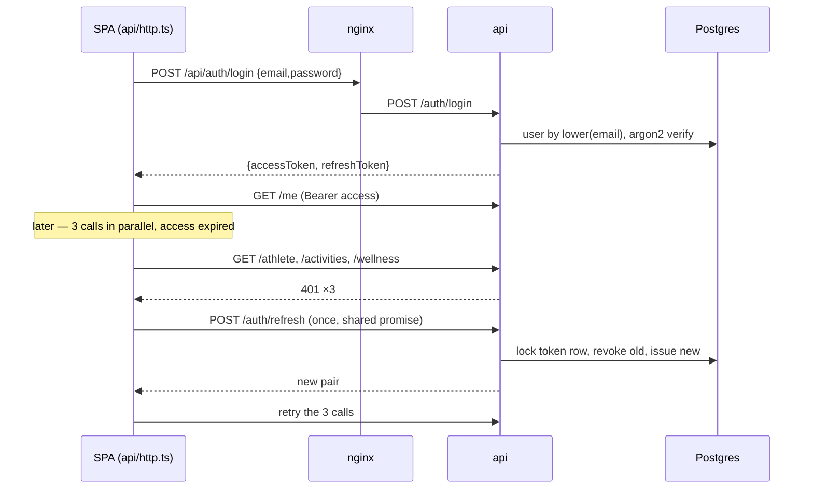
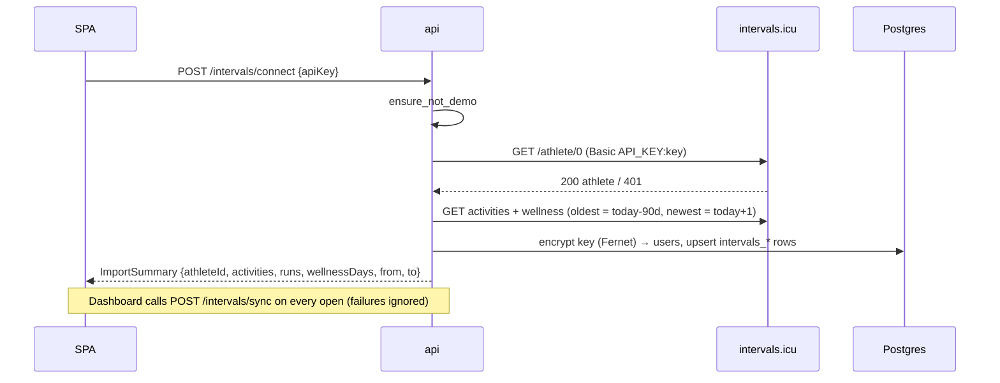
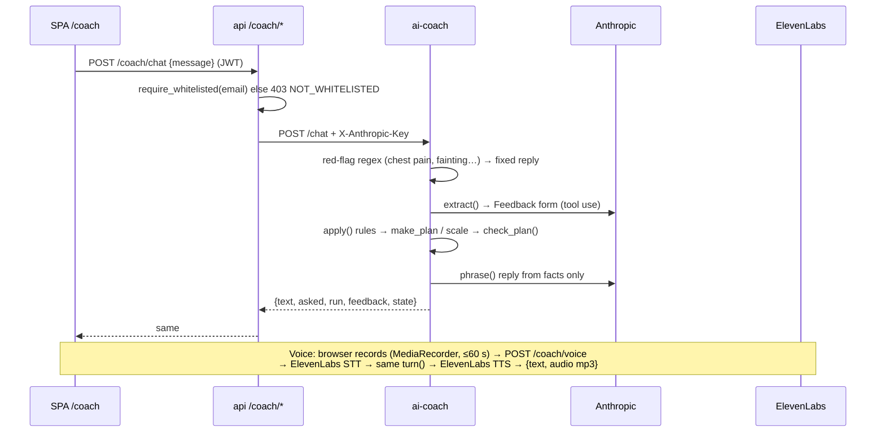
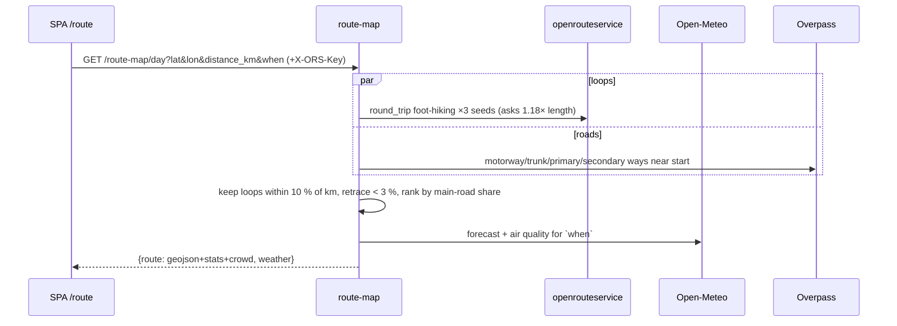
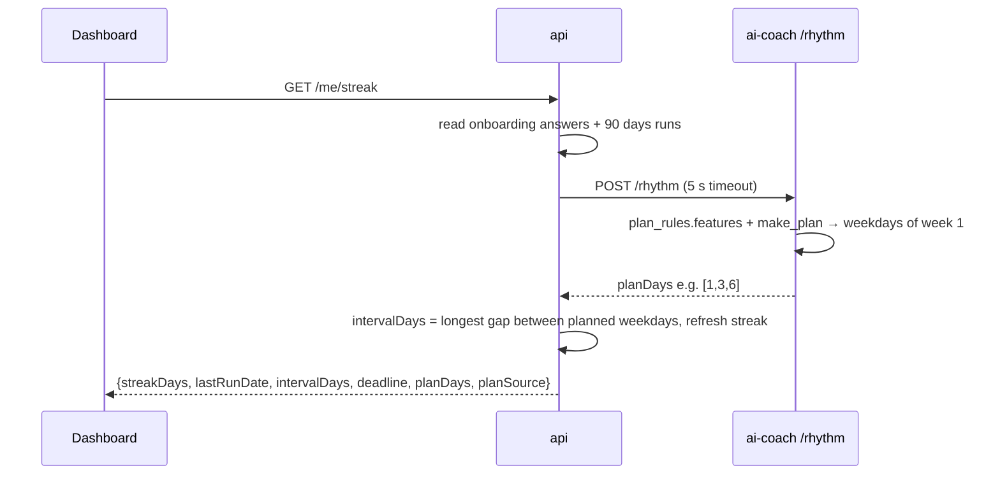
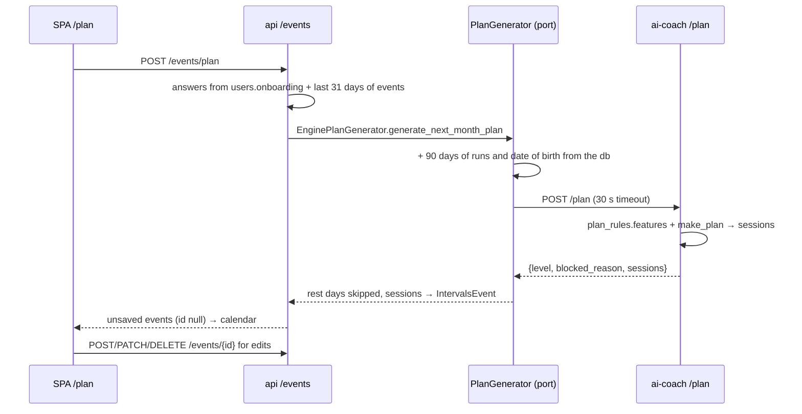

# Request flows

Back to [[00 Home]] · Services in [[System overview]], endpoints in [[API reference]].

## 1. Login and silent token refresh
Access token 15 min, refresh token 30 days, **rotated on every refresh**. Replaying an old refresh token signs
out every session (reuse detection). The frontend makes sure parallel 401s share **one** refresh.

If another tab already refreshed (stored token ≠ the one that got 401) the client just retries with the stored one.

## 2. Connect intervals.icu and import

`newest = today + 1` because intervals.icu filters by the athlete's **local** date while the server runs in UTC
(debug-03: a 01:30 local walk was missing).

## 3. Coach chat / voice

## 4. Route for today

## 5. Run streak (plan rhythm)

If the engine is down, it falls back to the user's picked run days, then to a default of 3.

## 6. AI Plan (target design)

Events use the seed format ("Easy run 4.9 km", a colour per type, pace/HR lines in the description), so the
calendar reads seeded and generated plans the same way. If the engine is down → 503 `PLAN_UNAVAILABLE`.
Live check (backend-11): Kuba → 200 in 0.04 s, 12 events.
