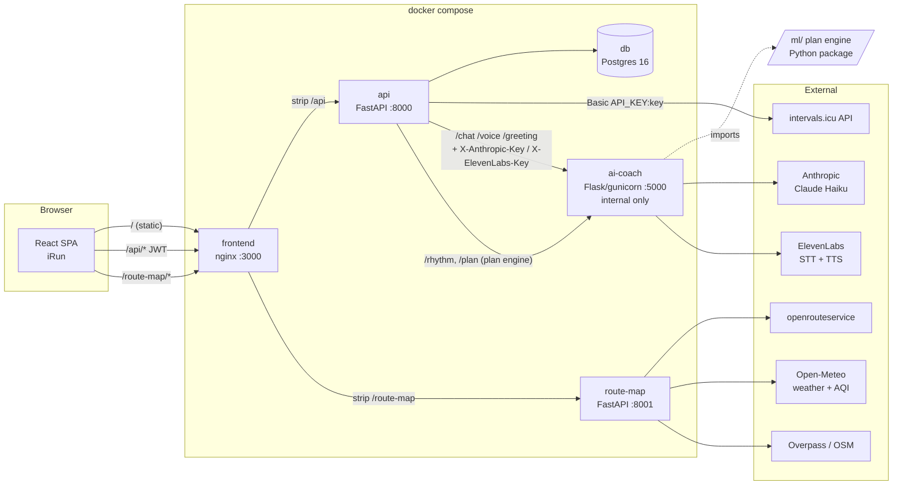

# System overview

Back to [[00 Home]] · Details: [[Request flows]], [[Infrastructure]]

Five services in one `docker-compose.yml`. The browser only ever talks to **one origin** (nginx on :3000);
nginx proxies `/api/*` to the API and `/route-map/*` to the route service, so there is no CORS in practice.

## Who owns what
| Service | Port | Talks to | Note |
|---|---|---|---|
| `frontend` (nginx 1.27) | 3000 | api, route-map | Serves `dist/`, SPA fallback, proxies; 6 MB body + 90 s timeout on `/api/` for voice |
| `api` (FastAPI, Python 3.12) | 8000 | db, intervals.icu, ai-coach | The only service with user identity and secrets. [[Backend]] |
| `db` (Postgres 16‑alpine) | 127.0.0.1:5432 | — | Schema from `scripts/sql/*.sql` on first init. [[Data model]] |
| `ai-coach` (Flask + gunicorn) | 5000 (internal) | Anthropic, ElevenLabs, `ml/` | Gets API keys **per request** from the api. [[AI coach iRunny]] |
| `route-map` (FastAPI) | 8001 | ORS, Open‑Meteo, Overpass | No DB, no auth; key via `X-ORS-Key` or env. [[Route map]] |
| `ml/` | — | — | A Python package, not a service; imported by ai-coach (and the seed generator). [[ML planner]] |

## Key ideas
- **Same origin everywhere:** Vite dev proxy and nginx do the same rewrite, so the frontend code is identical in
  dev and Docker.
- **API is the gatekeeper:** coach access is checked by the api (whitelist) *before* any key is read; the coach
  container itself has no keys.
- **Mock mode:** `VITE_API_MOCK=1` swaps the HTTP client for a full localStorage implementation of the same
  `Api` interface — the whole UI works without any backend.
- **ML is in‑process, not a microservice:** the coach imports `ml/` directly; the backend has a `PlanGenerator`
  port waiting for an implementation ([[Known limits and backlog]]).
