# AI coach iRunny

Back to [[00 Home]] · Folder `ai-coach/` · Guide `ai-coach/README.md` · Logs: ai-01, ai-call-01, ai-call-02,
frontend-15, PR #52

## The idea in one line
**The AI only understands you; code and the plan engine decide; `check_plan()` refuses anything unsafe.**

## How a message is handled

```mermaid
flowchart LR
    M[Message<br/>≤500 chars] --> RF{Red-flag regex<br/>chest pain, fainting,<br/>dizziness, breath}
    RF -- hit --> STOP[Pause plan<br/>fixed 'see a doctor']
    RF -- no --> EX[extract&#40;&#41;<br/>Claude tool use →<br/>Feedback form]
    EX --> AP[apply&#40;&#41;<br/>rules]
    AP --> CH[check_plan&#40;&#41;<br/>ml/plan_rules]
    CH -- ok --> PH[phrase&#40;&#41;<br/>warm reply<br/>from facts]
    CH -- refused --> PH
    PH --> OUT[text + new plan + asked]
```

Two model calls per message (default Claude **Haiku 4.5**, `COACH_MODEL` overrides): `extract()` reads,
`phrase()` writes. If `phrase()` fails, the plain list of changes is shown.

## What it understands
| Says | Coach does |
|---|---|
| "too hard" | checks last 2 weeks of real runs; if data says you were fine, says so and asks "keep or lighten?"; lighten = all upcoming runs ×0.85, quality → easy, floor 60 % of original |
| "too easy" | ×1.05 — often refused by the 10 % weekly cap, and says why |
| pain | asks 0–10. 1–3 mild → re‑plan from Monday, no progression/quality. ≥4 → no plan, see a physio. Mild twice → pause |
| ill | same as mild pain |
| "can't run Sundays" | day names → numbers in code, re‑plan without those days |
| "how was my last run?" | debrief computed in code (bpm over target, pace off, zone); model gets relative numbers only |
| off‑topic / jailbreak | fixed redirect, no reply model call |
| impossible request ("run 40 km Saturday") | says plainly what it can do |
PR #52 added: readiness nudge on the dashboard (wellness + last run), injury follow‑up, safety tier, missed runs,
a week away, moving a session, race result → threshold pace, two bad weeks → treated like "too hard".

## Voice call
Browser records with MediaRecorder (≤ 60 s) → `/coach/voice` → **ElevenLabs** speech‑to‑text (scribe_v1) →
same `turn()` as chat → ElevenLabs text‑to‑speech (multilingual v2) → reply text + mp3. Call UI: ring + pickup
sound, greeting, a pulsing orb that follows voice loudness (Web Audio), turn‑based (no interrupting).

## In the product
- Page `/coach`: Chat / Call switch, suggestion chips, quick‑reply buttons (Yes/No, 0–10).
- Access: api checks an **email whitelist** (`Kuba1234@kuba.com`) → 403 `NOT_WHITELISTED` otherwise. Keys forwarded
  per request as `X-Anthropic-Key` / `X-ElevenLabs-Key`.
- Testing: `test_coach.py` with a fake model client (no key); `live_check.py` — 25 reading cases, full
  conversations and 8 attacks against the real model.

## Known limits
- One plan in memory shared by everyone whitelisted; the plan is the sample athlete's, not the logged‑in user's
  (per‑user state is the next step, see [[Known limits and backlog]]).
- Not a medical device — software rules, not clinical safety.

See also [[Security and privacy]], [[ML planner]].
