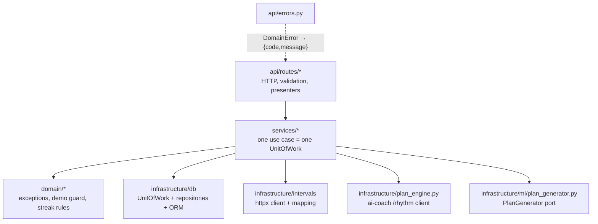

# Backend

Back to [[00 Home]] · Folder `backend/` · Logs: auth-01, backend-01…09, integration-02/03, ml-33

## Stack
FastAPI · Pydantic v2 (camelCase via `ApiModel`) · SQLAlchemy 2.0 · psycopg 3 · Postgres 16 · PyJWT · pwdlib
(argon2) · cryptography (Fernet) · httpx · pytest · ruff. Python 3.12 in Docker/CI.

## Layers (clean architecture)

- **Routes** are thin; **services** own transactions (`UnitOfWork`: commit on success, rollback on error).
- **Domain errors** map to HTTP in one table (`api/errors.py`).
- Dependency injection in `api/deps.py` — the single place to bind implementations (e.g. `get_plan_generator`).

## Services
| Service | Does |
|---|---|
| `AuthService` | login, refresh rotation + reuse detection, logout, password change |
| `UserService` | register, profile/city/public flag, email change, delete, public profile |
| `AthleteService` | body profile upsert, merged `Athlete` view |
| `IntervalsService` | verify key, encrypt, import 90 days (range ends today+1), sync, disconnect |
| `StreakService` | asks the plan engine for the week's run days, computes interval/deadline, refresh/reset |
| `EventsService` | calendar events CRUD |
| `PlanService` | collects last month of events + answers → `EnginePlanGenerator` → ai-coach `/plan` → calendar events |
| coach routes | whitelist check, forward to ai-coach with API keys in headers |

## Startup
`lifespan` seeds the demo account `jan@demo.run` from `app/seed/sample/*.json` (disable with `SEED_DEMO=false`).
If the DB has no schema yet, it logs and keeps serving.

## Testing
- `tests/conftest.py`: each run creates a throwaway `test_<random>` schema, each test in a rolled‑back
  transaction; random JWT/Fernet secrets per run. Needs `TEST_DATABASE_URL` (env or root `.env`).
- `test_routes.py` freezes the route table (contract with the frontend).
- `tests/integration/` (`-m integration`) runs against the real compose stack: health, SQL scripts created all
  tables, **ORM models match the real schema**.
- intervals.icu is faked with `httpx.MockTransport` — no real key in CI.

## Gotchas we hit
- Schema changes need a DB wipe/ALTER (no migrations) — debug-05, debug-06.
- FastAPI 0.142 nests routers, so the route test reads `app.openapi()["paths"]`.
- UTC server vs athlete local date in intervals.icu queries — debug-03.

More: [[Data model]], [[API reference]], [[Security and privacy]].
