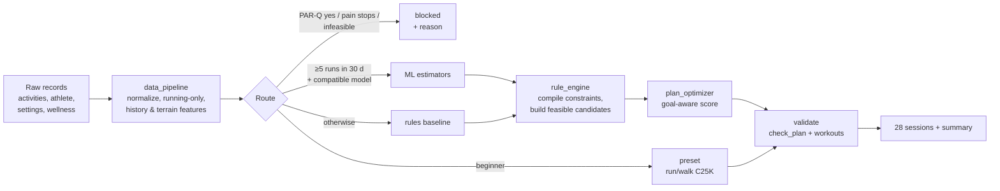

# ML planner

Back to [[00 Home]] · Folder `ml/` · Guide `ml/README.md` · Logs: ml-01 … ml-33, running-data-01, planning-01

## What it does
Input: a runner's intervals.icu history (activities, athlete, sport settings, optional wellness) + the
onboarding answers. Output: a **28‑day plan starting on a Monday** — one row per day with type
(`rest | easy | long | tempo | intervals | race`), distance, duration, pace range, HR range, run/walk
segments and a note — plus a summary (`o_source`, `o_level`, `o_blocked_reason`, `o_readiness`…).
Deterministic: same inputs → same plan.

Entry point: `ml.planning_flow.process_and_plan(source, context, as_of, parq_yes)`.

## Pipeline

1. **Constraints first.** Daily availability and time caps, weekly volume growth (≈10 % rule), cutback weeks,
   taper before a race, long‑run share of the week, hard days separated, a historical longest‑run guard.
   Predictions can never widen these limits.
2. **Route.** Beginners → run/walk presets (progression in running minutes). Eligible experienced runners →
   saved models. Otherwise → checked rules baseline. Unsafe → blocked with a reason.
3. **Search.** A finite set of schedules and distance allocations; each candidate validated before scoring.
4. **Validate** the chosen plan again (segments, pace ranges, totals, repetitions).

Week 1 is `current`, weeks 2–4 `provisional`. Illness / mild pain check‑ins reduce volume and remove quality work.

## The models
- Four XGBoost estimators: session type, weekly km, long‑run km, threshold pace — on 32 pipeline `r_*` features
  incl. terrain / grade‑adjusted pace.
- Trained on synthetic runners + **real 16‑week histories from run_ww 2019** (BMClab, CC BY 4.0) with
  rule‑generated labels.
- Contracts are versioned (`running-data-v11`, `running-plan-input-v8`, `running-features-v4-runner-terrain`);
  incompatible/old bundles are **rejected** and planning falls back to rules — that's what runs today.
- **Honest finding (ml-31):** the estimators mostly imitate the rules. Next step (ml-32, in progress): outcome
  models that predict what *happens to the runner* (speed, distance, 14‑day break risk) from 45,658 real
  decisions of 7,879 athletes. Speed has a weak real signal; distance mostly reflects habit; break risk vs load
  is not identifiable → the rules' ceilings remain the safety bound.
- **Benchmark (ml-27):** closed‑loop simulator with hidden fitness, injuries, illness, dropout; a model must beat
  habit, naive +7 %/week, random and rules on pre‑registered margins. `python -m ml.benchmark selftest`.

## Scope decisions
- **Running only** (Run, TrailRun, VirtualRun). Other sports removed from features (ml-29).
- Race distance is context, not a separate model per race.
- Target design: engine constraints → feasible candidates → **two learned optimizers (speed, distance)** →
  validation. Owned by the model developer; not delivered yet.

## Who uses it
- [[AI coach iRunny]] imports `plan_rules.make_plan` / `check_plan` (every coach edit is re‑checked).
- `POST /rhythm` (coach service) → weekly run days for the streak.
- `scripts/sql/seed.sql` events were generated with `process_and_plan`.
- `POST /plan` (coach service) → the AI Plan page via the backend's `EnginePlanGenerator` (backend-11).
  This uses `make_plan` (rules); the model‑ranked `process_and_plan` path is not in the app yet.

## Verified numbers (from logs)
- devops-02: 136 tests / 354 subtests; real‑history generator **273 requests / 3,026 sessions / 0 rule violations**.
- Synthetic eval: 100 athletes / 382 requests — preset 194, rules 13, ML→rules fallback 163, blocked 12.
