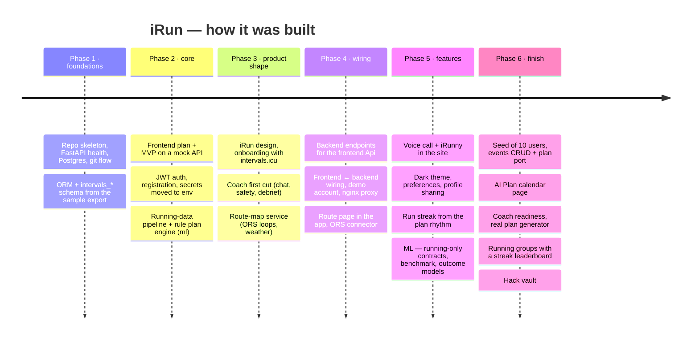

# Timeline

Back to [[00 Home]] · Reconstructed from `archieve/` and `git log` (3–4 October 2026). Phases are approximate ordering, not exact times.

## By area
### Infrastructure
devops-01 git flow → frontend-06 frontend Docker → ci-01 frontend tests in CI → ci-02 local DB tests → ci-03
secret scanning → ci-04 full deploy pipeline → compose-01 permission fix → compose-02 **dropped server deploy**
→ env-01 env auto‑append → compose-03 route‑map container → git-01/02 release squashes.

### Backend
backend-01 ORM → backend-02/03/04 intervals.icu schema, models, tests → auth-01 auth → backend-05 camelCase →
backend-06 endpoints for the frontend → integration-02/03 contract paths + demo seed → backend-08 sharing →
backend-09 streak → groups-01 groups + streak leaderboard → ml-33 PlanGenerator port → backend-10 events CRUD + plan endpoint → backend-11 real plan generator → backend-07 (spec) connectors.

### Frontend
frontend-01 plan → 02 MVP (mock) → 03/04 UX review + fixes → 05 iRun look + onboarding → 07 real intervals.icu +
body step → 08 onboarding polish → 09 training questions → integration-04/05 HTTP client → frontend-09 Route page →
integration-06 ORS key → 10 icons → 11 theme → 12 preferences → 13 sharing UI → 14 AI Plan → 15 coach refresh →
16 AI Plan on `/events`.

### ML
ml-01 data proposal → pipeline (running-data-01) → plan rules + presets → XGBoost estimators → audits (ml-09, 21,
25) → fixes (24, 26) → shared contracts (28) → running‑only (29) → remote integration (devops-02: terrain, run_ww)
→ benchmark (27) → honest audit: models imitate rules (31) → outcome models (32).

### Coach
ai-01 chat + safety + debrief → ai-call-01 voice → ai-call-02 in the site behind a whitelist → `/rhythm` for the
streak (backend-09) → frontend-15 page refresh → PR #52 readiness, safety tier, more actions.

### Route
map-01 service → frontend-09 page → integration-06 user key → compose-03 Docker → debug-04 location errors.
